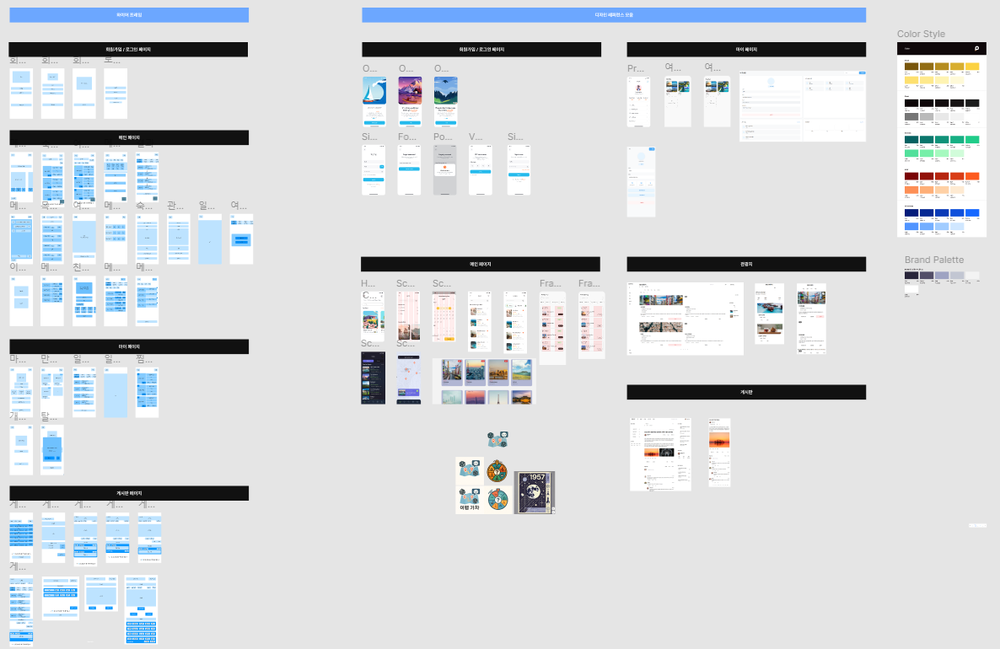
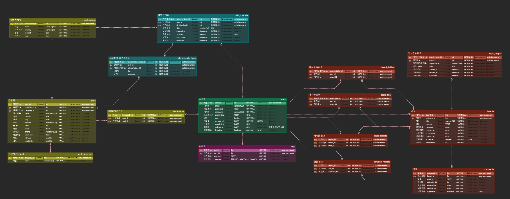

# TripGacha (트립가챠)

- 기타 프로젝트 진행시 발생한 산출물

## 🗂 목차

1. [기능 명세서](#-기능-명세서)
2. [API 명세서](#-api-명세서)
3. [Front 목업](#-front-목업)
4. [ERD](#-erd)
5. [회의록](#-회의록)

---

## 📄 기능 명세서

- Notion : [기능 명세서](https://trail-nail-193.notion.site/1e00407f9787802fa151ec67d6d48f04?pvs=4)

## 📡 API 명세서

- Notion : [API 명세서](https://trail-nail-193.notion.site/API-1e00407f97878165a45ef55dd398ae77?pvs=4)
- Swagger 문서(서버 실행 시) : [Swagger](http://localhost:8080/api/swagger-ui/index.html)

---

## 🎨 Front 목업

- Figma 링크: [Front 목업](https://www.figma.com/design/PO3i7JoPOLs2XTNI9f1tWQ/TripGacha?node-id=3-136&p=f&t=cyp2AmUTkKZuLtZN-0)

---

## 🗃 ERD

- ERD 설계 툴: [ERDCloud](https://www.erdcloud.com/d/9xCNb6AfNncS8ifCy)

주요 테이블 설명:

- **users**: 사용자 계정 정보
- **destinations**: 목적지 정보 (서울, 부산 등)
- **boards**: 게시글 정보
- **spots**: 관광지 정보
- **trip_schedule**: 여행 일정 정보

## 📄 회의록

- summary 폴더 참고
