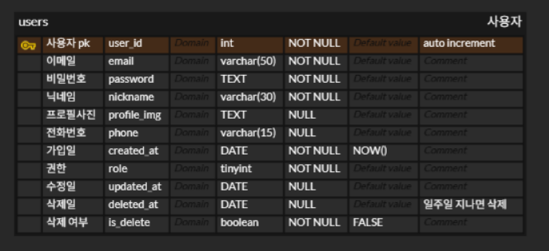

# SSAFY_TRIP_FINAL_PARKSANGCHAN_HONGJEONGHOON

## 일시 : 25.04.25 (금)

# 1. 기능 명세서 작성

## 1. 지도 기능

---

- 지도에서 여행지 핑 보여주기
- 루트 보여주기

## 2. 회원 기능

---

- 필수
  - 회원 CRUD
    - 회원 가입
    - 회원 정보 수정
    - 회원 정보 조회 → 마이페이지
    - 회원 탈퇴
  - 로그인, 로그아웃
    - 아이디 기억하기
  - 아이디, 비번 찾기
  - (할 수 있다면) OAuth

## 3. AI 기능

---

- AI 여행 추천 채팅 기능

## 4. 게시판 기능

---

- 게시판 CRUD
  - 게시글 CRUD
    - 게시글 조회
    - 게시글 등록
    - 게시글 수정
    - 게시글 삭제
  - 게시글 신고?
  - 게시글 좋아요 / 싫어요
  - 게시글 카테고리
  - 댓글 CRUD
    - 댓글 조회
    - 댓글 등록 (대댓글)
    - 댓글 삭제
    - 댓글 좋아요
    - 댓글 신고
- 여행 일정 공유 게시판
- 자유 / 질문 / 건의 게시판
- 인기 게시판

  - 좋아요를 가장 많이 받은 게시물 (명예의 전당)

- 여행지 둘러보기

## 5. 여행 일정 계획 도움 기능 (플래너)

---

(1) 여행지 입력 받기

(2) 여행 일정 입력 받기 (시작일 ~ 종료일)

(3) 숙소 입력 받기

- 사전에 이미 예약한 숙소가 있으면 입력받기
- 없으면 숙소 추천부터 제공

(4) 방문할 여행 장소 입력 받기

- 해당 지역에서 별점 기반 내림차순으로 정렬해서 보여주기
- 카테고리 선택, 검색을 통한 필터링

- 신규 장소 등록하기 (선택)
- 여행지 찜하기

- 그래서 선택한 지역은 장바구니 같은 곳에 모아서 저장

(5) 이동 수단 선택

(6) 일정표 생성 ( 여행 일자 별 추천 이동 루트 )

- 편집 기능
- 저장 기능

일대일

다수

## 6. 여행 일정 계획 도움 기능 (게임)

---

- **바로 정해주기**
  - 가위바위보 [일대일] [다수]
  - 룰렛 [일대일] [다수]
  - 사다리 타기 [일대일] [다수]
  - 코인 토스 (동전 앞면 뒷면) [일대일]
    - n면체 굴리기 [일대일] [다수]
  - 화면 바뀔 때 가장 빨리 누른 사람이 승리 [일대일] [다수]
- **심리전**
  - 러시안 룰렛 [일대일] [다수]
    - 번갈아가면서 쏘기 → 본인 차례에 무작위 회전 시키기 가능
      - 쏘다 보면 최대 6번까지 쏠 수 있는데
      - 회전 시키면 최대 6 (N+1)번 쏠 수 있고 긴장감 넘침
  - 인디언 포커 [일대일] [다수]
    - 상대방의 카드와 행동을 분석해서 내 카드가 더 높을 것이라 판단되면 베팅해서 승리하기
    - 사행성?
  - 눈싸움 [일대일]
    - 나랑 상대랑 화면 반 나눠져서 각자의 눈을 보여줌
    - 내 화면 누르면 눈을 조금 뜨고, 상대방 꺼를 누르면 눈을 조금 감는다
    - 눈은 시간 지날 때마다 저절로 조금씩 감긴다
    - 먼저 눈 감기는 사람이 패배
  - 악어 입에 손 넣기 [일대일] [다수]
    - 이빨을 눌렀을 때 입이 닫히면 패배

# 2. 회원 ERD 설계

# 3. 프로젝트 디자인 툴 선정

| 🧩 항목            | visily                                    | Figma                                                                                                             |
| ------------------ | ----------------------------------------- | ----------------------------------------------------------------------------------------------------------------- |
| 사용 편의성        | ✅ 비전문가도 쉽게 와이어프레임 작성 가능 | ✅ 직관적인 앱 디자인으로 사용 편의성 높음                                                                        |
| **사용 난이도**    | ✅ 초보자 친화적                          | ⚠️ 러닝커브 있음                                                                                                  |
| 협업 기능          | ⚠️ 실시간 협업, but 피그마보다 느림       | ✅ 실시간 협업, 버전 관리, 팀 라이브러리 완비                                                                     |
| **AI 기능**        | 🤖 이미지 → 와이어프레임 자동 생성        | 🧩 플러그인으로 기능 확장 가능 ⚠️ 기본 AI 기능은 제한적 💵 돈내면 엄청난 AI 기능 제공 🌐 cursor와의 연동 |
| 📘 **학습 리소스** | ⚠️ 커뮤니티 작음                          | ✅ 방대한 커뮤니티 + 공식 자료 다수                                                                               |

위처럼 각각의 장점을 비교해본 결과,
비록 러닝커브는 높지만, 공식 자료가 많고 커뮤니티가 방대해서 문제 상황에서 빠르게 해답을 찾을 수 있으면서
**싸피의 교육지원금**을 활용하면 강력한 서비스를 제공받을 수 있는 Figma를 사용하기로 결정했습니다.
