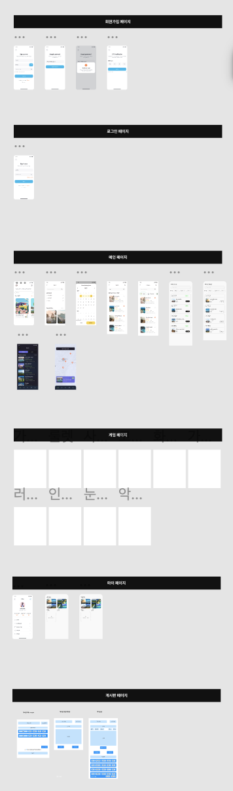

# SSAFY_TRIP_FINAL_PARKSANGCHAN_HONGJEONGHOON

## 일시 : 25.05.02 (금)

# 1. 사이트 디자인 + 컨셉 구상

## 1. figma community 참고

- 사이트 요구사항에 맞는 템플릿을 추려내어 우리 사이트 디자인을 구상
  
- 구상한 페이지
  - 로그인 / 회원 가입
  - 지도 (여행지 맵핑)
  - 메인 페이지
  - 게임 페이지

## 2. 스키마 설계

- 기존 사이트의 구상 + 저번 주에 완성한 기능 명세서를 통해 스키마 설계를 마무리 할 수 있었습니다.
  
- 회원
  - 회원 테이블
- 여행지
  - 여행지 테이블
  - 관광지 테이블
  - 찜한 관광지 테이블
  - 사용자의 여행 루트 테이블
  - 사용자 여행 루트에 포함되는 관광지 테이블
- 게시글
  - 게시글 테이블
  - 댓글 테이블
  - 게시글 이미지 테이블
  - 게시글 좋아요 / 싫어요 / 신고 테이블
